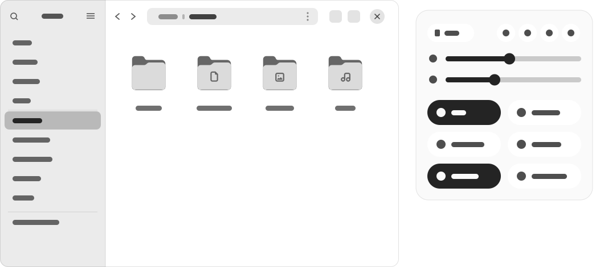
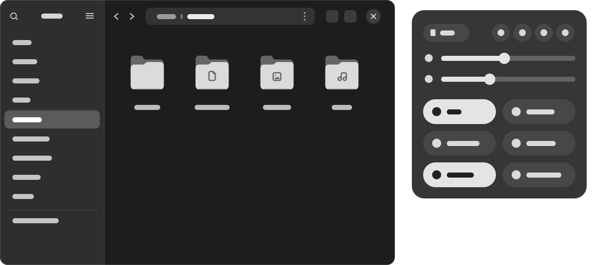
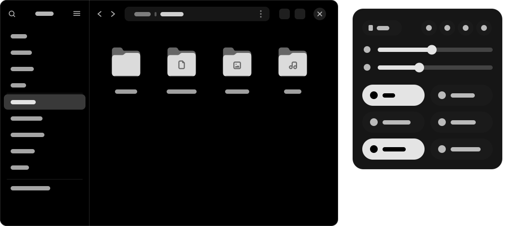

# Monolith

A clean monochrome GTK and GNOME Shell theme for GNOME ≥ 48.

Removes Adwaita's default blue cast on neutral surfaces, offering pure neutral grays (**Classic**) and true pitch-black surfaces (**Black**).

| | |
|---|---|
| **Monolith-Classic**<br> | **Monolith-Classic-dark**<br> |
| **Monolith-Black**<br> | **Monolith-Black-dark**<br> |

## Installation

```bash
curl -fsSL https://raw.githubusercontent.com/ztrahmet/gnome-theme-monolith/main/install.sh | bash
```

This installs the theme and sets up the **`monolith-theme`** CLI manager in `~/.local/bin`.

> **Note**: GNOME Shell theming requires the [User Themes](https://extensions.gnome.org/extension/19/user-themes/) extension.

## Theme Manager

Use `monolith-theme` to manage your installation:

```bash
monolith-theme                      # Interactive menu
monolith-theme --install [Theme]    # Select theme (e.g. Monolith-Black)
monolith-theme --status             # View active theme & configuration
monolith-theme --schemes            # Match GtkSourceView editors to the theme
monolith-theme --flatpak            # Enable Flatpak theming
monolith-theme --uninstall          # Revert and uninstall
```

## Styles

- **Monolith-Classic**: GNOME's own palette with the blue cast removed, leaving neutral grays (Light & Dark).
- **Monolith-Black**: Pitch-black canvas with dark neutral surfaces (Dark).

Both are recolorings, not restyling. The accent is a plain light gray, and anything drawn on top of it — label text, checkmarks, the switch dot — takes the window's own background color, so accented elements stay monochrome. Status colors (error, warning, success) remain native.

### Icons

A **Monolith** icon theme recolors Adwaita's folder icons to match, and inherits Adwaita for everything else. It installs and applies alongside the theme.

### Editor Schemes

GtkSourceView apps (Text Editor, Builder) choose their colour scheme independently of the GTK theme, so their text area otherwise keeps Adwaita's tint. Monolith installs matching schemes alongside the themes, and on install switches any app still on the Adwaita default over to them. A scheme you picked yourself is never overridden. Use `monolith-theme --schemes` to apply everywhere, or `--no-schemes` to revert. Syntax colors stay native.

### Lock Screen (optional)

The lock screen runs with extensions disabled, so it keeps GNOME's default Shell theme. To include it, add `unlock-dialog` to the User Themes extension's session modes:

```jsonc
// /usr/share/gnome-shell/extensions/user-theme@gnome-shell-extensions.gcampax.github.com/metadata.json
"session-modes": ["user", "unlock-dialog"]
```

Log out to apply. A `gnome-shell-extensions` update reverts it.

## Building

```bash
make build       # Compile and assemble themes in build/themes/
make check       # Run the test suite
make install     # Install from source
make dist        # Create release archives in dist/
make clean       # Clean build artifacts
make preview     # Regenerate docs/previews/ (needs ImageMagick)
```

**Requirements**: `sassc`, `make`, `curl`, `tar`, `zip`.

## Documentation

- [docs/ARCHITECTURE.md](docs/ARCHITECTURE.md) — Source layout and build pipeline.
- [docs/PALETTE.md](docs/PALETTE.md) — Color tokens and design rules.

## License & Credits

- GTK 3 is based on [adw-gtk3](https://github.com/lassekongo83/adw-gtk3) (LGPL-2.1-only).
- Upstream assets from [libadwaita](https://gitlab.gnome.org/GNOME/libadwaita) and [gnome-shell](https://gitlab.gnome.org/GNOME/gnome-shell).
- Licensed under **GPL-3.0-or-later** (see [LICENSE](LICENSE)).
